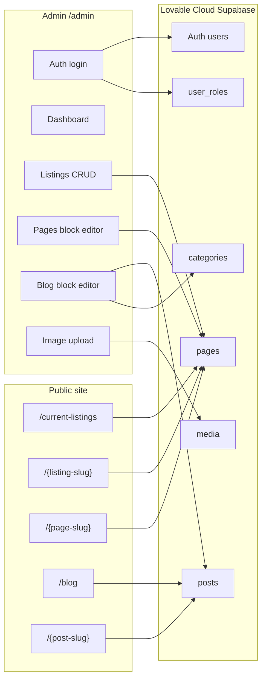

# Section handoff — Lovable Cloud CMS (Listings + Blog Admin)

> **Scope:** Admin dashboard so Stanley (and Feroz) can create/edit/unpublish **property listings**, **freeform Pages** (block builder), and **blog posts** (block body) without hand-editing TypeScript. Public site keeps Montfort listing/blog/page chrome; data from **Lovable Cloud Supabase** when env is set, else static registries.  
> **Not in scope:** Replacing listing MLS form with blocks; Instagram CMS; neighborhood-guide CMS; full canvas page builders; GHL paste unless requested.
> **Added 2026-08-28:** Google reviews are now CMS-backed — synced into `public.google_reviews` twice a week by a `pg_cron` job, with hide/reorder controls at `/admin/reviews`. See `LOVABLE-GO-LIVE.md` for the one-time Vault setup.

**Date:** 2026-08-24  
**Parent handoff:** `HANDOFF.md` / `DOCUMENTATION.md`  
**Companion docs:** `CMS-ADMIN.md` (Stanley how-to), `LOVABLE-GO-LIVE.md` (path map + overlay), `scripts/lovable-overlay-manifest.txt`  
**Local workspace:** `d:\GHL_Montfort` on branch **`local-root`** (app under `ghl-react/`)  
**Deploy target for this stream:** **Lovable** (app at repo root) — **not** GitHub `main` / GHL unless explicitly requested  
**Local preview:** `http://127.0.0.1:5173/` · Admin: `http://127.0.0.1:5173/admin/login`

---

## 1. Why this stream exists

Today (and historically for GHL) content is **code-first**:

| Content | Code-first location | Shared UI |
|---------|---------------------|-----------|
| Listings | `src/data/listings/*.ts` + `index.ts` | `ListingPageContent` |
| Blog | `src/blog/articles/<slug>/` + `registry.ts` | `BlogArticleLayout` |

Adding a listing/post = edit code + rebuild/ship. Client wants Stanley to manage content in an **Admin** UI; public pages auto-update using the same designs.

**Stack decision (fixed):** Lovable project + **Lovable Cloud Supabase** (Auth, Postgres, Storage). Native Lovable path; email/password for Stanley.

---

## 2. Architecture (current)



### Data mapping (Lovable Cloud schema — live)

Discovered / confirmed against project `zmnoguzttgqufgooitpx`:

| Montfort concept | Cloud table | Notes |
|------------------|-------------|--------|
| Blog article | `posts` | `title, slug, excerpt, body, status, published_at, category_id, author_id` |
| Blog category | `categories` | `name, slug, description` |
| Property listing | `pages` | Listing JSON in `body` with `__montfort: "listing"`; MLS form unchanged |
| Freeform page | `pages` | `{ "__montfort": "page", "version": 1, "blocks": [...] }` + optional `lead` |
| Admin privilege | `user_roles` | `user_id` + `role` (e.g. `admin`) — **not** a role column on `profiles` (privilege-escalation safe) |
| Profile display | `profiles` | `id, email, display_name, avatar_url` |
| Uploaded assets | `media` | `file_path, mime_type, alt_text` + Storage bucket ideally named `media` |

**Blog `posts.body` shape:** preferred `{ "__montfort": "article", "version": 1, "blocks": [...] }`. Raw HTML without the marker is treated as a **single text block** on read (`parseArticleBody` / `htmlToBlocks`).

**Block types:** `heading` (h2/h3), `text` (sanitized HTML), `image`, `gallery`, `container` (nested), `divider`, `cta`. Shared: `src/lib/cms/blocks.ts` → `blocksToHtml` + sanitize. Admin UI: `src/admin/blocks/BlockEditor.tsx`.

**Legacy (do not use on Cloud):** custom `listings` / `blog_posts` / `profiles.role` from `supabase/migrations/001_cms.sql` — file is **commented out / superseded**. Lovable Cloud runs its own migrations; there is **no SQL Editor paste step** for the client.

### Env (local `ghl-react/.env` — gitignored)

Required for CMS:

- `VITE_SUPABASE_URL`
- `VITE_SUPABASE_PUBLISHABLE_KEY` **or** `VITE_SUPABASE_ANON_KEY` (app accepts either — see `src/lib/supabase.ts`)

Never put **service role** in Vite/Lovable client env.

Without env: public site keeps working on **static** `ALL_LISTINGS` + `BLOG_ARTICLE_REGISTRY`.

---

## 3. Key files (local `ghl-react/`)

| Path | Role |
|------|------|
| `src/lib/supabase.ts` | Client; publishable/anon key |
| `src/lib/cms/auth.ts` | Login; admin via `user_roles` |
| `src/lib/cms/health.ts` | Dashboard setup probes |
| `src/lib/cms/listings.ts` | Public + admin listings ↔ `pages` listing JSON |
| `src/lib/cms/pages.ts` | Freeform pages ↔ `pages` page+blocks JSON |
| `src/lib/cms/blocks.ts` | CmsBlock types, parse/serialize, `blocksToHtml`, legacy HTML → text block |
| `src/lib/cms/blog.ts` | Public + admin blog ↔ `posts` (article blocks) |
| `src/lib/cms/seed.ts` | Import static TS → Cloud (blog HTML → single text block JSON) |
| `src/lib/cms/upload.ts` | Storage `media` + `media` row |
| `src/lib/cms/sanitize.ts` | DOMPurify for text/CTA HTML |
| `src/lib/cms/types.ts` | Cloud row types + listing JSON marker |
| `src/admin/AdminGate.tsx` | Route guard + admin chrome (Listings / Pages / Blog) |
| `src/admin/blocks/BlockEditor.tsx` | Shared block editor (blog + pages) |
| `src/pages/admin/*` | Login, dashboard, listing/pages/blog CRUD |
| `src/components/cms/BlockPageRenderer.tsx` | Public freeform page in Montfort chrome |
| `src/pages/CmsSlugPage.tsx` | CMS `/{slug}`: listing → freeform page → blog |
| `src/pages/ListingDetailPage.tsx` | Async `fetchPublishedListingBySlug` |
| `src/pages/BlogArticlePage.tsx` | Async `fetchPublishedBlogBySlug` |
| `src/components/listings/CurrentListingsContent.tsx` | CMS listings index |
| `src/components/blog/BlogContent.tsx` | CMS blog cards (fallback static) |
| `src/App.tsx` | `/admin/*` routes; hide mobile header on admin |
| `src/styles/admin.css` | Admin UI |
| `scripts/create-admin-user.mjs` | Create Auth user (needs confirm + role SQL) |
| `scripts/lovable-overlay-manifest.txt` | Exact overlay list for Lovable git |
| `CMS-ADMIN.md` / `LOVABLE-GO-LIVE.md` | Operator + ship playbooks |

---

## 4. End-to-end flows

### 4.1 Admin login

1. Open `/admin/login`.
2. `signInWithPassword` → session JWT.
3. Load `user_roles` for `user_id`; require `role = 'admin'`.
4. Non-admin → sign out + error. Unconfirmed email → clear “Email not confirmed” message (Auth must confirm user in Lovable).
5. Success → `/admin` (Dashboard) inside `AdminGate` shell.

### 4.2 Dashboard

- Health checklist: env + `pages` / `posts` / `user_roles` / `profiles` / `media`.
- Counts: listings/posts live vs draft (from Cloud).
- Actions: New listing, New blog post, **Import static content**, links to lists.
- How-it-works card when schema ready.

### 4.3 Create / edit listing (Stanley)

1. `/admin/listings` → New / Edit.
2. Form fields mirror listing template (price, beds, address, overview, hero upload/URL, Published).
3. Save → `pages` upsert: `title`, `slug`, `status`, `author_id`, `body` = `serializeListingPageBody(listing)`.
4. Preview → public `/{slug}` uses `ListingPageContent` + `buildListingSeo`.
5. Delete/unpublish → set `status` to `draft` (soft).

### 4.4 Create / edit blog post

1. `/admin/blog` → New / Edit.
2. Title → `posts.title`; lead → `excerpt`; **BlockEditor** → `body` as article blocks JSON; category → ensure `categories` row + `category_id`.
3. Published → `status = published` + `published_at`; else draft.
4. Public: `blocksToHtml` → `BlogArticleLayout` (TOC from heading blocks when present). Legacy raw HTML bodies still render via single text-block parse.

### 4.4b Create / edit freeform page

1. `/admin/pages` → New / Edit.
2. Title, slug, optional lead + BlockEditor → `pages.body` = `{ "__montfort": "page", version: 1, blocks, lead? }`.
3. Published → live at `/{slug}` with `PageShell` + `BlockPageRenderer` (not a third-party builder look).
4. Listings remain on the MLS form under `/admin/listings` (same `pages` table, different `__montfort` marker).

### 4.5 Public read path

| URL | Source order |
|-----|----------------|
| `/current-listings` | Published `pages` with listing JSON; if none → `ALL_LISTINGS` |
| `/{slug}` (CmsSlugPage) | Listing JSON → freeform page blocks → blog post → NotMigrated |
| `/blog` | Published `posts` cards if any; else hardcoded `ARTICLES` |
| Registry blog routes | CMS by slug first, else `BLOG_ARTICLE_REGISTRY` |

### 4.6 Import static content

Admin-only: upserts all `ALL_LISTINGS` → `pages`, all `BLOG_ARTICLE_REGISTRY` → `posts` (+ categories). Blog bodies are stored as **article blocks** (existing HTML wrapped in one `text` block). Images keep existing `/redesign-assets/...` URLs unless re-uploaded.

### 4.7 Lovable ship (when git URL provided)

1. Clone Lovable repo to **sibling** (e.g. `D:\GHL_Montfort_lovable`) — not into `local-root` as `main`.
2. Overlay `src/`, `public/`, docs per `LOVABLE-GO-LIVE.md` / manifest.
3. Merge `package.json` (`@supabase/supabase-js`, `dompurify`, …); `bun install`.
4. Keep `.lovable/`; set `VITE_SUPABASE_*` in Lovable secrets.
5. Smoke admin + public.

**Do not** merge this stream into GitHub `main`/GHL unless the owner explicitly asks.

---

## 5. Where we stand (2026-08-24)

### Done

| Item | Status |
|------|--------|
| Admin UI (login, dashboard, listings / pages / blog CRUD) | Done in `ghl-react/` |
| Block editor (blog body + freeform pages) | Done — `BlockEditor` + `blocks.ts` |
| Freeform Pages admin + `BlockPageRenderer` | Done |
| CmsSlugPage: listing → page → blog | Done |
| Legacy HTML → single text block (read + seed) | Done |
| Public wire to CMS with static fallback | Done |
| XSS sanitize on blog save/render | Done |
| Health/setup UX for Cloud tables | Done |
| Auth via `user_roles` (not `profiles.role`) | Done |
| Listings ↔ `pages` JSON payload | Done |
| Blog ↔ `posts` + `categories` | Done |
| Seed import button | Done |
| Env: Lovable publishable key support | Done |
| Lovable go-live docs + overlay manifest | Done |
| Local `.env` pointed at Cloud project | Done (gitignored) |
| Auth user created: `ferozarshad99@gmail.com` | Done (user id `4f470993-be70-43f3-a668-df226a46d66e`) |
| Strong password issued | Done (shared out-of-band — never record it in this repo) |

### Blocked / in progress (owner actions on Lovable Cloud)

| Item | Status | Owner action |
|------|--------|----------------|
| **Email confirmation** for Feroz user | **BLOCKING login** | Auth → Users → confirm email (or disable confirm-email for dev) |
| **`user_roles` admin row** | **BLOCKING admin UI** | `insert into user_roles (user_id, role) values ('4f470993-be70-43f3-a668-df226a46d66e', 'admin');` |
| Storage bucket `media` | Likely missing / empty | Create public bucket `media` for admin uploads |
| Stanley Auth user + admin role | Not created | Same pattern as Feroz |
| **Import static content** | Not run yet | After login works → Dashboard button |
| **Lovable git URL** | Not provided | Needed to clone/overlay and go live on Lovable hosting |
| Disable public Auth sign-up | Unknown | Confirm invite-only in Cloud Auth settings |

### Explicitly not started / deferred

| Item | Notes |
|------|--------|
| Overlay into real Lovable repo | Waiting on git URL (`await-lovable-git`) |
| Featured image field on `posts` | Cloud schema has no featured image column yet — cards/articles use fallback hood image unless URL pasted into future field / HTML |
| Rich-text WYSIWYG | Admin uses HTML textarea (sanitized), not TipTap/etc. |
| Instagram / reviews CMS | Out of plan |
| Push CMS to GitHub `main` for GHL | Separate from Lovable path; do not mix unless asked |
| Service-role automation for user create/confirm | No service key in `.env` (correct); confirm/role stay Cloud-side |

---

## 6. What we are working on now

**Current focus:** Unblock **first successful admin login** on local preview against Lovable Cloud, then seed content.

Immediate sequence:

1. Confirm Feroz email in Lovable Auth.
2. Insert `user_roles` admin for that UUID.
3. Sign in at `/admin/login` → Dashboard green checklist.
4. **Import static content**.
5. Smoke: edit one listing, one post, publish, hit public URLs.
6. When Lovable git arrives → overlay per `LOVABLE-GO-LIVE.md`.

---

## 7. What remains (checklist)

### A. Cloud access (this week)

- [ ] Confirm email for `ferozarshad99@gmail.com`
- [ ] Insert admin into `user_roles`
- [ ] Login succeeds at `/admin/login`
- [ ] Create Stanley user + `user_roles` admin
- [ ] Confirm Auth: public registration disabled
- [ ] Create Storage bucket `media` (public read; authenticated write per Cloud policies)

### B. Content

- [ ] Run **Import static content** once
- [ ] Spot-check `/current-listings`, one listing slug, `/blog`, one post slug
- [ ] Stanley dry-run: create draft listing → publish → unpublish

### C. Lovable go-live

- [ ] Receive Lovable git URL / invite
- [ ] Clone sibling worktree; overlay manifest
- [ ] Merge package.json; Bun install; set Lovable env secrets
- [ ] Deploy / custom domain HTTPS
- [ ] Go-live security checklist (drafts not public, anon cannot write, no service role in client)

### D. Optional polish

- [ ] Featured image column or media FK on `posts` (Cloud migration)
- [ ] WYSIWYG editor
- [ ] Archive soft-delete status vs draft-only
- [ ] Remove or archive static registries after Cloud is sole source of truth

---

## 8. Credentials & secrets (ops)

| Item | Where |
|------|--------|
| Publishable URL/key | Local `ghl-react/.env` (gitignored); Lovable secrets UI for deploy |
| Feroz admin email | `ferozarshad99@gmail.com` |
| Feroz user UUID | `4f470993-be70-43f3-a668-df226a46d66e` |
| Feroz password | Shared out-of-band only. **Never write a password into this repo.** Rotate in Lovable Cloud Auth if one was ever committed. |
| Service role | **Not** in client; only for optional server scripts |

**Promote admin SQL:**

```sql
insert into public.user_roles (user_id, role)
values ('4f470993-be70-43f3-a668-df226a46d66e', 'admin');
```

---

## 9. Security notes (required)

- Admins only via **`user_roles`** (never editable `profiles.role`).
- Public: published only; drafts author/admin per Cloud RLS.
- Blog HTML sanitized (DOMPurify allowlist).
- Anon/publishable key only in browser; no service role in bundle.
- Admin routes not in public nav/sitemap.
- Delete/unpublish: confirm dialogs in admin UI.

---

## 10. How the next agent should continue

1. Read **this file** + `LOVABLE-GO-LIVE.md` + `CMS-ADMIN.md`.
2. Verify `.env` has `VITE_SUPABASE_URL` + publishable key; `npm run dev` / Vite on `5173`.
3. If login still fails: confirm email + `user_roles` (section 5–7).
4. After login: Import static → smoke public pages.
5. Do **not** resurrect custom `listings`/`blog_posts` tables unless Cloud schema changes.
6. Do **not** flatten `local-root` or merge into GitHub `main` for this stream without explicit ask.
7. When user pastes Lovable git URL: execute overlay playbook in `LOVABLE-GO-LIVE.md`.

---

## 11. Related section handoffs

| Doc | Relationship |
|------|----------------|
| `HANDOFF.md` | Parent: folders, GHL ship rules |
| `HANDOFF-SECTION-blog-articles.md` | Static blog registry (still fallback + seed source) |
| `CMS-ADMIN.md` | Stanley day-to-day |
| `LOVABLE-GO-LIVE.md` | Path rewrite + Bun merge + overlay |
